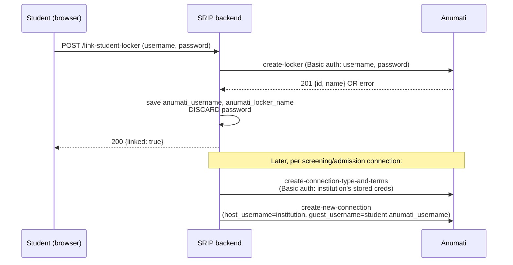

# Sprint 8 — Locker Linking

**Status:** Implemented and tested (15/15 backend tests passing).
**Depends on:** Sprints 6–7 (`anumati_integration/client.py`, `mock_client.py`).
**Feeds into:** Sprints 9–10, which already consume the fields this sprint populates.

## 1. What this sprint replaces

Before this sprint, the only way a `User` or `Institution` had
`anumati_locker_name` / `anumati_admissions_locker_name` set was
`seed_demo` writing them directly into the database. That was fine for
demoing the 100-applicant scenario, but it meant nobody had actually built
the thing a real student or institution admin uses to connect their own
Anumati account. This sprint builds that: four endpoints, a frontend
page, and the model/settings changes underneath them.

Nothing about the screening/admission connection logic (`services.py`)
changes in what it does — only in *whose* credentials it now uses to do
it (see §4).

## 2. Data model changes

| Model | New field | Purpose |
|---|---|---|
| `users.User` | `anumati_username` | The student's Anumati account username. May differ from their SRIP username. |
| `users.User` | `anumati_linked_at` | Timestamp, for the status UI. |
| `users.Institution` | `anumati_password_encrypted` | The institution's Anumati password, Fernet-encrypted at rest (see §5). |
| `users.Institution` | `anumati_linked_at` | Timestamp, for the status UI. |

(`anumati_locker_name` / `anumati_admissions_locker_name` and
`anumati_username` on `Institution` already existed from Sprint 7's
schema seam — this sprint is what actually populates them via user
action instead of a management command.)

Migrations: `users/migrations/0003_institution_anumati_linked_at_and_more.py`,
`users/migrations/0004_user_anumati_username.py`.

## 3. API reference

All endpoints require a valid JWT (`Authorization: Bearer <token>`), mounted under `/api/anumati/`.

### `GET /api/anumati/status/`
Returns the caller's own link state, and their institution's (if any).

```json
{
  "user_linked": true,
  "user_verified": false,
  "user_locker_name": "Academic",
  "user_linked_at": "2026-08-05T12:13:05.383300+05:30",
  "institution_linked": null,
  "institution_locker_name": null,
  "institution_linked_at": null,
  "portal_url": "https://anumati.iiitb.ac.in/login"
}
```
`institution_*` fields are `null` for a student (no `institution` set), and reflect the student's institution's status for faculty/institution_admin. `portal_url` is `settings.ANUMATI_PORTAL_URL` — the frontend never hardcodes it.

### `POST /api/anumati/link-student-locker/`
**Role:** student only (403 otherwise).

Request — `anumati_password` is **optional**:
```json
{ "anumati_username": "...", "locker_name": "Academic" }
```
or, to verify immediately:
```json
{ "anumati_username": "...", "anumati_password": "...", "locker_name": "Academic" }
```
Response (`200`):
```json
{ "linked": true, "verified": false, "locker_name": "Academic", "linked_at": "...", "warning": "Linked without verification -- ..." }
```
If `anumati_password` is omitted, this is a **self-attested** link from
the redirect-out flow (see §6.1): SRIP never calls Anumati and
`verified` is `false`. If a password is provided, SRIP makes one call to
`create-locker` to confirm the locker exists, `verified` is `true`, and
the password is discarded either way — only `anumati_username`,
`anumati_locker_name`, `anumati_linked_at`, and `anumati_verified` are
persisted on `User`.

### `POST /api/anumati/unlink-student-locker/`
Clears the three fields above. No body required.

### `POST /api/anumati/link-institution-locker/`
**Role:** `institution_admin` only (403 for faculty and students).

Request/response shape mirrors the student endpoint, but the password
**is** persisted (encrypted — see §5), because Anumati's current API
requires it on every subsequent host-side call this institution's
connections make.

### Error handling (both link endpoints)
| Condition | Response |
|---|---|
| Anumati returns 401/403 (bad credentials) | `400`, `{"detail": "Could not authenticate with Anumati: ..."}` — treated as a hard failure. |
| Anumati returns any other error (e.g. locker name already exists for that account) | `200`, with a non-null `warning` string — treated as a soft success; we assume the person is relinking an existing locker and save the reference anyway. |
| Wrong role | `403`, `{"detail": "..."}` |

## 4. Security model



- **Student passwords are never persisted.** This is enforced, not just
  documented — `AnumatiLinkingEndpointTests.test_student_can_link_locker`
  asserts the submitted password string doesn't appear anywhere in the
  saved `User` instance's `__dict__`.
- **Institution passwords are persisted, encrypted.** This is a
  deliberate, documented stopgap: Anumati's current API is HTTP Basic on
  every request (confirmed against a live instance — see the architecture
  doc's API findings), so SRIP's backend has no way to act as the host
  side of a connection without holding that credential somewhere. The
  encryption is Fernet (symmetric), keyed by `ANUMATI_CREDENTIAL_KEY`
  (see `.env.example`; a dev default is baked into `settings.py` so local
  setup works out of the box, but **must** be overridden with a real
  generated key — see the comment in `.env.example` — for anything beyond
  local dev).
- **The real fix is out of SRIP's hands.** This whole stopgap goes away
  if/when Anumati adds a scoped service-account or OAuth2 client-
  credentials mode. That's tracked as "Phase 0: protocol hardening" in
  the architecture doc, not something SRIP can build around further.

## 5. What changed in `anumati_integration/services.py`

Two bugs were caught and fixed while wiring this sprint in:

1. **Global credentials → per-institution credentials.** Every host-side
   call (`create_connection_type`, `create_connection`,
   `close_connection_host`) now passes
   `institution.anumati_username` / `institution.get_anumati_password()`
   explicitly, instead of relying on `AnumatiClient`'s fallback to one
   global `ANUMATI_HOST_USERNAME`/`ANUMATI_HOST_PASSWORD` env var. Without
   this fix, every institution on the platform would have been acting as
   whichever institution's credentials happened to be in the server's
   environment — a real multi-tenancy bug, not a hypothetical one.
2. **SRIP username → linked Anumati username.** `guest_username` in both
   connection-creation calls now reads
   `student.anumati_username or student.username` — preferring the
   Anumati username the student actually linked, falling back to their
   SRIP username only if they haven't (or linked before this sprint
   existed).

`_student_ready()` and `_institution_ready()` (the guards that make
`on_submitted`/`on_admitted` no-op gracefully for unlinked accounts) now
both read the `anumati_linked` property on their respective models
instead of checking individual fields inline.

## 6. Frontend

`frontend/src/pages/LinkAnumatiPage.jsx`, routed at `/anumati`:
- **Student view — two-step, redirect-first:**
  1. "Open Anumati" opens the real portal (`ANUMATI_PORTAL_URL`, defaults
     to `https://anumati.iiitb.ac.in/login`) in a new tab. The student
     logs in / creates a locker there — SRIP never sees a password this
     way.
  2. "Confirm your locker" — the student types back their Anumati
     username and locker name. This is saved with `anumati_verified =
     False` (self-attested — see §4.1). An optional, collapsed "verify
     immediately with your password" field is still available: if filled
     in, SRIP makes the one-time `create_locker` verify call from Sprint
     8's original design and marks the link `anumati_verified = True`.
  - The status card shows a **Verified** / **Unverified** pill so this
    distinction is visible, not silent.
- Institution admin view: unchanged from the original design (§4) —
  always asks for and stores the password, since it's needed for every
  future host-side call regardless.
- Faculty view: read-only status of their institution's link state.
- `PostingDetailPage` shows a soft (non-blocking) banner nudging an unlinked student toward `/anumati` before they apply.

### 6.1 Why self-attested linking exists at all

The original Sprint 8 design always asked a student for their Anumati
password, used it once for a `create_locker` verify call, then discarded
it. That's secure, but it isn't what a real redirect-based integration
looks like — and when pointed at the actual deployed portal
(`https://anumati.iiitb.ac.in/login`), a real gap showed up: **that
portal is a plain React SPA with no visible `redirect_uri`/callback
parameter support.** There is no way for Anumati to hand control back to
SRIP automatically the way a UPI app does. This is the same finding as
the architecture doc's Phase 0 gap (HTTP Basic auth only, no OAuth2
authorization-code flow) — confirmed again here, against the live public
instance rather than only the local dev instance.

Given that constraint, there are exactly two honest options: keep asking
for the password directly in SRIP (defeats the purpose of redirecting
out at all), or accept that a true redirect-out flow can only produce a
**self-attested** link — SRIP trusts what the student types back,
without proof. This sprint implements both, and is explicit in the UI and
API about which one happened (`anumati_verified` on `User`, surfaced as a
pill in the frontend and a field in `GET /api/anumati/status/`).

If Anumati ever adds an OAuth-style callback, `anumati_verified` becomes
`True` automatically on every redirect-based link and the "optional
password verify" field can be removed entirely — that's the intended
migration path, not a parallel permanent feature.

## 7. Manual QA checklist

- [ ] Fresh `seed_demo` run, then log in as `student_demo_050`, visit `/anumati` — should already show linked (seed sets it directly), confirm unlink → relink works.
- [ ] As a newly registered student, visit `/anumati` — click "Open Anumati" and confirm it opens `https://anumati.iiitb.ac.in/login` (or `ANUMATI_PORTAL_URL`) in a new tab, unmodified.
- [ ] Submit step 2 (username + locker name) with no password — should show an **Unverified** pill and the "linked without verification" warning text.
- [ ] Expand "verify immediately", submit with a password — should show a **Verified** pill (mock mode: always succeeds).
- [ ] Log in as `faculty_demo`, visit `/anumati` — should see read-only institution status, no form.
- [ ] Log in as a new `institution_admin` signup with no institution set — link attempt should 400 with a clear message, not a 500.
- [ ] Submit a new application as an unlinked student — banner should appear on the posting page; application should still succeed (soft nudge, not a hard block).

## 8. What's still open after this sprint

Locker linking gets fields populated correctly; it does not yet make
anything *live*. Specifically still open (see root `README.md`):
- No status-sync job — a connection created via `services.py` sits
  `pending` in `AnumatiConnectionRecord` until Sprint 11's polling job
  exists.
- No reviewer document view (Sprint 11).
- No reverse-direction certificate delivery through the admission
  connection's `HOST→GUEST` terms (Sprint 12).

## 9. 2026-08-06 update — `client.py` rewritten against a new Anumati backend

The Anumati team shared a substantially rewritten backend
(`DPI-Primitive-Jenkins-dev` — this is what's now live at
`https://anumati.iiitb.ac.in`). It was run locally and exercised directly
(not inferred from source) to confirm what changed before touching
`client.py`:

| | Old (2026-07-31) | New (2026-08-06, confirmed live) |
|---|---|---|
| Auth | HTTP Basic, every request | JWT bearer — login once (`POST /auth/login/`), then `Authorization: Bearer <token>` |
| Endpoint mounting | Site root (`/create-locker/`) | Namespaced (`/locker/create/`, `/connectionType/...`, `/connection/...`, `/auth/...`) |
| `create-connection-type-and-terms` returns its own id? | No (confirmed) | Still no (confirmed) — `create_connection_type()`'s follow-up lookup is still required |
| Duplicate connection-type name+direction | Silently allowed (no constraint) | **Rejected**, `400`, `"...already exists in '<locker>'."` — a new server-side uniqueness constraint |

**Only `anumati_integration/client.py` changed.** `services.py`, `views.py`,
`hooks.py`, and every test outside the client itself needed zero changes
— this is the adapter pattern doing its job (architecture doc, "one
adapter, not scattered calls"). All 16 pre-existing tests still pass
unmodified; 3 new tests were added directly against `AnumatiClient`
(mocked HTTP) to cover the login-then-Bearer flow and the idempotency fix
below.

**A real bug this caught:** the new uniqueness constraint means SRIP's
existing pattern — register one `ConnectionType` per purpose, reuse it
across every application (exactly what the architecture doc recommends) —
broke on the *second* application for the same posting, because
`create_connection_type()` always attempted to create first. Confirmed
live: the first application's screening connection succeeded; the
second failed with `"Connection type 'SRIP Application Screening' with
the same direction already exists in 'Admissions'."` `client.py` now
catches that specific 400 response and falls through to the existing
lookup instead of raising — verified both against the mocked test and,
again, live against the real instance (a second application for the same
posting now correctly reuses `connection_type_id` from the first).

This is arguably a net improvement in Anumati's own data integrity (it
now prevents silent duplicate connection-type registration), but it's a
breaking API change for any existing integrator that, like SRIP
originally did, assumed create was safe to call repeatedly.
